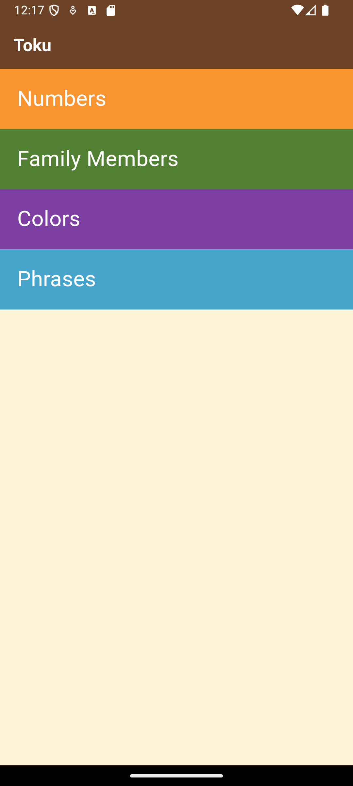
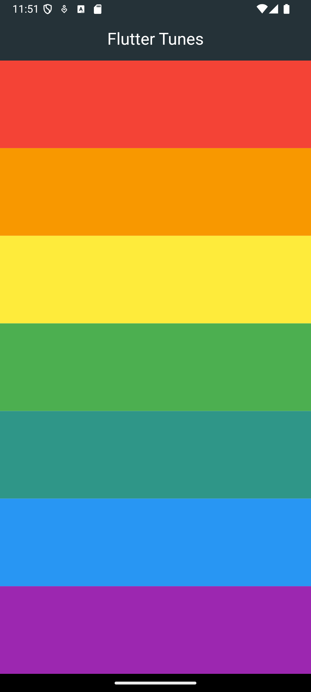
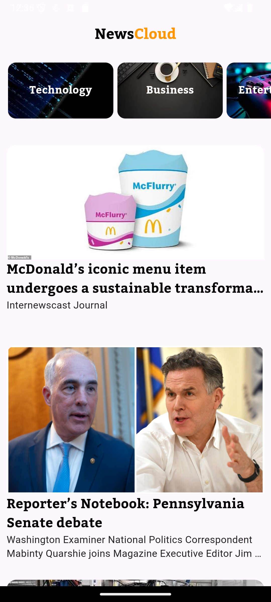
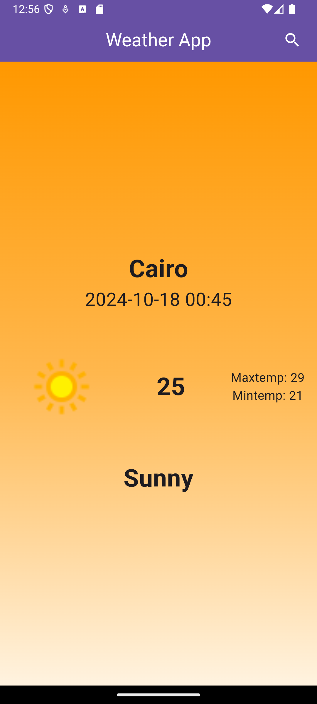
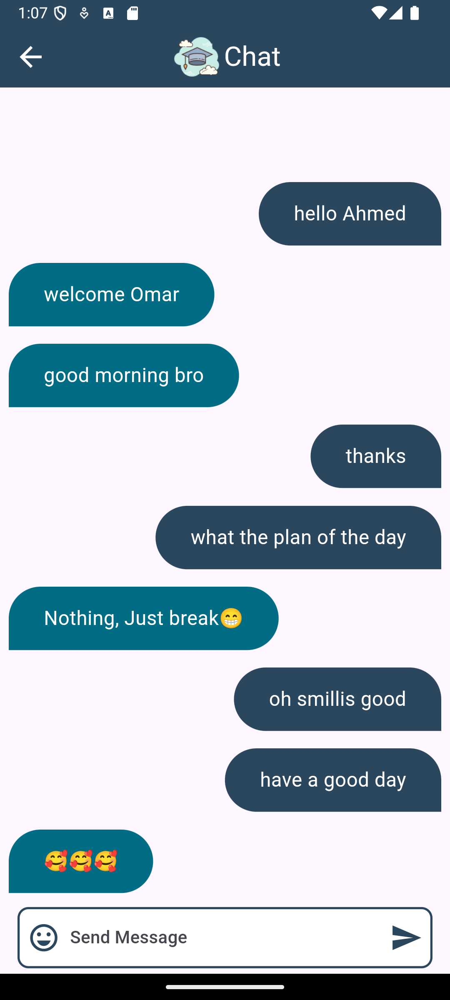
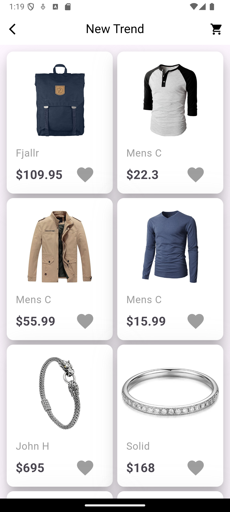

EngTharwatCourse_Practice
This repository contains the projects I developed as part of the Flutter beginner course by Eng. Tharwat Samy on Udemy. Each project represents a step in my journey to becoming proficient in Flutter, combining course concepts with my personal touch and challenges.

**1️⃣# Projects Overview**

Below are the projects I completed during the course, displayed with their respective screenshots. Each project helped me understand various aspects of Flutter development such as UI design, state management, animations, and integrations.

<table> <tr> <td> Birthday Card</td> <td> Basketball Points Counter</td> <td> Business Card</td> <td> Toku App</td> <td> Tunes App</td> </tr> <tr> <td> News App</td> <td> Weather App</td> <td> Chat App</td> <td> Store App</td> <td> Note App</td> </tr> </table>

Here's an improved version with better formatting and organization for the "Project Descriptions" and "Technologies Used" sections:

**2️⃣# Project Descriptions**
- Birthday Card: A simple app to celebrate birthdays with a personalized card.

- Basketball Points Counter:An app to keep track of the points for two basketball teams.

- Business Card: A digital business card showcasing contact details and styling elements.

- Toku App: An app featuring sounds and visual cues for learning the Toku language.

- Tunes App: A basic app for exploring and playing tunes with a minimal interface.

- News App: A news aggregator app that displays top news stories from various sources.

- Weather App: A weather application that shows current conditions for selected cities.

- Chat App: A simple chat application that supports real-time messaging.

- Store App: An e-commerce app layout, providing product listings and details.

- Note App: A CRUD-based notes application using Hive for local storage.

**3️⃣# Technologies Used**
- Flutter: For building beautiful UIs and handling the state of the app

- Dart: As the primary language for Flutter development.

- Firebase: For backend support (authentication, Firestore) in some of the apps.

- Hive: For local database storage in the Note App.

**4️⃣# Future Improvements**
I plan to continue refining these projects by:

- Improving UI/UX design.
- Enhancing performance with more efficient state management techniques.
- Adding new features to expand the functionality of each app.