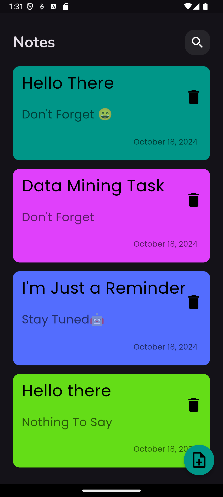

# EngTharwatCourse_Practice
My work for Flutter beginner Course by Eng Tharwat Samy @Udemy as a practice for the content of the Course with my touch as a challenge for me.

# Projects:

<table>
  <tr>
    <td></td>
    <td></td>
    <td></td>
    <td></td>
    <td></td>
  </tr>
  <tr>
    <td></td>
    <td></td>
    <td></td>
    <td></td>
    <td></td>
  </tr>
</table>
